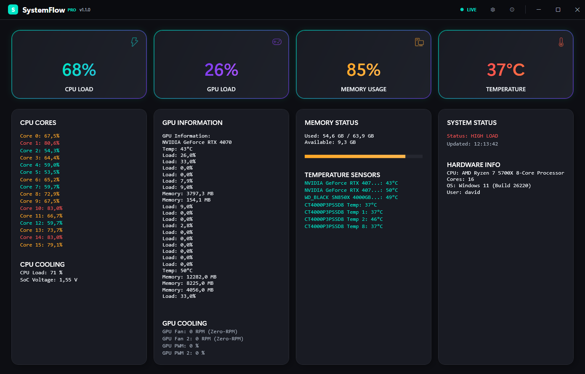

# 🚀 SystemFlow Pro

> **Modern systemövervakning för Windows 11**

En elegant realtidsapplikation för övervakning av systemresurser med professionell design och äkta hårdvarudata.


---

## ✨ Funktioner

🔥 **Realtidsövervakning** - CPU-kärnor, GPU-belastning, minne och temperaturer  
❄️ **Äkta fläktdata** - RPM-värden från LibreHardwareMonitor inklusive Zero RPM Mode  
🎨 **Modern design** - Glassmorphic UI optimerat för Windows 11  
⚡ **Automatiska uppdateringar** - Data uppdateras varje sekund  
🛡️ **Administratörsläge** - Startar automatiskt med UAC för full hårdvaruåtkomst  

---

## 🖼️ Screenshot



---

## 🚀 Snabbstart

### Förutsättningar
- **Windows 11** (rekommenderat)
- **.NET 9.0 Desktop Runtime** [↗ Ladda ner](https://dotnet.microsoft.com/download/dotnet/9.0)

### Installation

#### 📦 **Alternativ 1: Färdig exe-fil (Enklast)**
1. **Ladda ner** `publish-with-icon/SystemMonitorApp.exe`
2. **Högerklicka** → "Kör som administratör"  
3. **Acceptera UAC-prompten**

#### 🔧 **Alternativ 2: Bygg från källkod**
1. **Klona repository**
   ```bash
   git clone <repository-url>
   cd FannyKnob
   ```

2. **Bygg applikationen**
   ```bash
   dotnet build SystemMonitorApp.csproj
   ```

3. **Starta applikationen**
   ```bash
   Start-Process -FilePath ".\bin\Debug\net9.0-windows\SystemMonitorApp.exe"
   ```

> 💡 **Tips:** Den färdiga exe-filen (122MB) innehåller allt och kräver inte .NET installation

---

## 📊 Vad övervakas

| Kategori | Detaljer |
|----------|----------|
| **CPU** | Total belastning + individuella kärnor |
| **GPU** | NVIDIA/AMD belastning, temperatur, VRAM |
| **Minne** | Användning i realtid med progressbar |
| **Temperaturer** | Alla systemsensorer med färgkodning |
| **Fläktar** | CPU/GPU/System fläktar med RPM-status |
| **System** | Hårdvaruinfo och systemstatus |

---

## 🔧 Teknisk information

- **Framework:** .NET 9.0 WPF
- **Hårdvarubibliotek:** LibreHardwareMonitor 0.9.4
- **UI:** Modern glassmorphic design med mörkt tema
- **Uppdateringsfrekvens:** 1 sekund
- **Behörigheter:** Automatisk UAC-prompt för administratörsrättigheter

---

## ⚠️ Viktigt att veta

- **Zero RPM Mode:** Moderna GPU-fläktar stannar vid låga temperaturer (~<60°C)
- **Administratörsrättigheter:** Krävs för att läsa hårdvarusensorer
- **Hårdvarukompatibilitet:** Fungerar bäst med moderna Windows 11-system

---

## 🛠️ Felsökning

**Applikationen startar inte?**
- Installera .NET 9.0 Desktop Runtime
- Högerklicka → "Kör som administratör"

**Saknar sensor-data?**
- Kontrollera att UAC-prompten accepterats
- Vissa äldre system har begränsad sensorsupport

**Build-fel?**
```bash
# Använd specifik dotnet-sökväg om standard inte fungerar
& "C:\Program Files\dotnet\dotnet.exe" build SystemMonitorApp.csproj
```

**Skapa egen packad exe-fil:**
```bash
# Skapa ikon först (om du vill ändra den)
powershell -ExecutionPolicy Bypass -File "create_icon.ps1"

# Skapa självständig exe-fil med ikon
& "C:\Program Files\dotnet\dotnet.exe" publish SystemMonitorApp.csproj -c Release -r win-x64 --self-contained -p:PublishSingleFile=true -o publish
```

---

## 📄 Licens

MIT License - Se LICENSE-fil för detaljer

---

<div align="center">

**Utvecklad för Windows 11** • **Kräver administratörsrättigheter** • **Använder äkta hårdvarudata**

</div> 