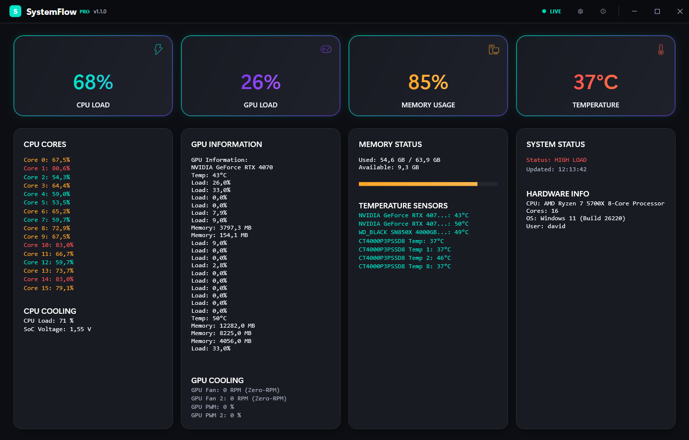

# SystemFlow Pro

**Lightweight and fast system monitoring for Windows — CPU, GPU, memory, temperatures, and fans in real time.**

[](https://www.microsoft.com/windows)
[](https://dotnet.microsoft.com/)
[](LICENSE)

---

## Overview

SystemFlow Pro is an open source system monitor for Windows built with
.NET 9 + WPF. It displays per-core CPU load, GPU status, memory usage,
temperature sensors, and fan speeds in real time. Designed to be a
faster, lighter alternative to HWiNFO64 and other large
monitoring tools.



---

## Installation

### Option 1 — Download the prebuilt exe (recommended)

1. Go to [GitHub Releases](https://github.com/screamm/SystemFlow_Pro/releases/latest)
2. Download `SystemFlow-Pro-vX.Y.Z-win-x64.zip`
3. Extract and run `SystemFlow-Pro.exe` — no installation, no .NET
   runtime installation required (self-contained single-file build)

The first time you run it, Windows SmartScreen may warn "Windows Defender
protected your PC". Click "More info" → "Run anyway". SystemFlow Pro is open source and
distributed unsigned — all code can be reviewed on GitHub. The warning diminishes
over time as the app builds SmartScreen reputation through downloads.

### Option 2 — Build from source

Requirements: .NET 9 SDK (9.0.305 or newer, see `global.json`).

```bash
git clone https://github.com/screamm/SystemFlow_Pro.git
cd SystemFlow_Pro
dotnet restore
dotnet run --project SystemMonitorApp.csproj
```

To create a self-contained distribution:

```bash
build.bat 1.1.0
```

This produces `publish\v1.1.0\SystemFlow-Pro.exe` and `releases\SystemFlow-Pro-v1.1.0-win-x64.zip`.

### Administrator privileges

The app requires administrator privileges (`requireAdministrator` in the manifest).
The Windows UAC prompt appears at every startup. This is necessary to read
MSR registers (CPU temperature on many modern CPUs), fan sensors via
SuperIO chips, and certain GPU sensors that are otherwise protected.

Without admin, most sensors would return "N/A" on modern systems —
so we chose admin-by-default rather than a degraded experience.

---

## Features

| Category | Details |
|----------|---------|
| CPU | Total load, per-core, temperature, Package power |
| GPU | NVIDIA / AMD / Intel load, temperature, VRAM |
| Memory | Total / used / available GB, percent, progress bar |
| Temperatures | All available sensors with color coding |
| Fans | CPU / GPU / chassis / pump — RPM or PWM %, properly distinguished |
| System | OS version, CPU name, core count, active user |
| Settings | Polling interval, °C/°F, pause on minimize |
| Diagnostics | File logger in `%APPDATA%\SystemFlow Pro\logs\` |

---

## Keyboard shortcuts

| Gesture | Function |
|---------|----------|
| Win+↑ | Maximize |
| Win+↓ | Minimize / restore |
| Win+Z | Snap Layouts (Windows 11) |
| Alt+F4 | Close |
| Tab | Cycle focus through chrome buttons |

---

## Technical information

- **Framework:** .NET 9, WPF
- **Hardware reading:** LibreHardwareMonitor 0.9.4 (MPL 2.0)
- **Architecture:** MVVM-lite with an extracted service layer
- **Testing:** 37 xUnit tests (status logic, OS name mapping, FanReading model)
- **Threading:** Background thread for all hardware reading, UI updates via
  snapshot pattern
- **Polling:** 2 seconds default (500ms–60s configurable)

See [`docs/ARCHITECTURE.md`](docs/ARCHITECTURE.md) for layer diagrams and
design decisions.

---

## Troubleshooting

**The app does not start — "Windows protected your PC" / SmartScreen**
Right-click the .exe → Properties → check "Unblock" → OK. Or in the warning dialog,
click "More info" → "Run anyway". SystemFlow Pro is distributed unsigned as
open source — SmartScreen does not recognize the publisher until the app has
enough downloads. The code can be reviewed on GitHub.

**No fans are displayed**
Not all motherboards expose RPM via LHM/WMI. Start the app as administrator
for additional sensors. Some GPU fans in zero-RPM mode correctly display "0 RPM".

**Temperatures missing**
Older CPUs have limited LibreHardwareMonitor support. See
`%APPDATA%\SystemFlow Pro\logs\app-*.log` for details.

**The app freezes or is slow**
Increase the polling interval in Settings (⚙ in the header) to 5 seconds. Please
send the log file to a [GitHub Issue](https://github.com/screamm/SystemFlow_Pro/issues)
if the problem persists.

---

## Privacy

SystemFlow Pro does not collect or send any personal data. The only
network call at startup is a version check against the GitHub Releases API.
See [`PRIVACY.md`](PRIVACY.md) for details.

---

## Contributing & feedback

- Bugs, feature requests: [GitHub Issues](https://github.com/screamm/SystemFlow_Pro/issues)
- Discussion: [GitHub Discussions](https://github.com/screamm/SystemFlow_Pro/discussions)
- Pull requests welcome — see `docs/ARCHITECTURE.md` before major changes

---

## License

MIT License — see [`LICENSE`](LICENSE).

Third-party libraries (in particular LibreHardwareMonitor MPL 2.0) are listed in
[`THIRD_PARTY_LICENSES.txt`](THIRD_PARTY_LICENSES.txt).

---

**Developed by David Rydgren · [@screamm](https://github.com/screamm)**
