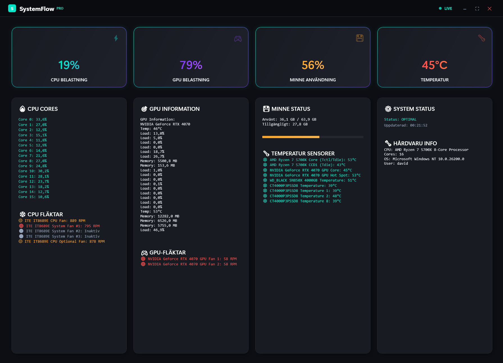

# 🐒 SystemMonkey - Avancerad Systemövervakare för Windows 11

En realtids-systemövervakningsapplikation som visar CPU-användning, minnesförbrukning, temperaturer och fläktinformation för Windows 11. Byggd med .NET 9 och WPF för moderna Windows-system.


## 📸 Screenshot


*SystemMonkey i aktion - visar realtidsdata för CPU, temperaturer och fläkthastigheter*

## ✨ Funktioner

### 🔥 **NYTT! Riktig Fläktövervakning**
- **LibreHardwareMonitor Integration** - Professionell hårdvaruövervakning
- **Riktiga Fläkthastigheter** - Visar faktiska RPM-värden för alla fläktar
- **Bred Hårdvarukompatibilitet** - Fungerar med moderna system och laptops
- **CPU & GPU Fläktar** - Övervakar alla typer av kylningssystem

### 📊 Systemövervakning
- 🖥️ **CPU-övervakning** - Realtid total CPU-användning och per-kärna användning
- 🧠 **Minnesanvändning** - Live minnesförbrukningsövervakning
- 🌡️ **Temperaturövervakning** - Detaljerade sensordatar från alla komponenter
- 🌀 **Fläktinformation** - Fläkthastigheter och status (LibreHardwareMonitor)
- 🎮 **GPU-information** - Grafikkortdetaljer och VRAM-användning
- 📊 **Systeminformation** - Datornamn, OS, processorspecifikationer
- ⚡ **Realtidsuppdateringar** - Data uppdateras varje sekund
- 🎨 **Modernt UI** - Mörkt tema optimerat för Windows 11

## 🛠️ Installation

### Förutsättningar

1. **Windows 11** (eller Windows 10)
2. **.NET 9.0 SDK** eller **.NET 9.0 Desktop Runtime**
3. **Administratörsbehörigheter** (rekommenderas för full funktionalitet)

### Steg 1: Installera .NET 9.0

1. Besök: https://dotnet.microsoft.com/download/dotnet/9.0
2. Ladda ner ".NET 9.0 Desktop Runtime" (för slutanvändare) eller ".NET 9.0 SDK" (för utvecklare)
3. Kör installationsprogrammet och följ instruktionerna

### Steg 2: Klona och Bygga

```bash
# Klona repository
git clone https://github.com/screamm/SystemMonkey.git
cd SystemMonkey

# Återställ paket
dotnet restore

# Bygg projektet
dotnet build

# Kör applikationen
dotnet run
```

### Alternativ: Visual Studio

1. Öppna `SystemMonitorApp.csproj` i Visual Studio 2022
2. Tryck F5 för att bygga och köra

## 🚀 Användning

### Köra som Administratör (Rekommenderat)

För full hårdvarudataåtkomst:

```powershell
# Starta med admin-rättigheter
Start-Process -FilePath "bin\Debug\net9.0-windows\SystemMonitorApp.exe" -Verb RunAs

# Eller med dotnet
dotnet run
```

### Applikationsfunktioner

- **Realtidsdata** - Uppdateras automatiskt varje sekund
- **Uppdateringsknapp** - Manuell uppdatering av systeminformation
- **Rullbar gränssnitt** - Visa all information bekvämt

## 📊 Vad som visas

### CPU-användning
- Total CPU-användning i procent
- Individuell belastning per CPU-kärna/tråd

### Minne
- Tillgängligt minne i GB
- Använt vs. fritt minne

### Temperaturer
- **CPU-temperaturer** - Alla kärnor och sensorer
- **GPU-temperaturer** - Grafikkort och klockhastigheter
- **Moderkortstemperaturer** - Systemsensorer
- **Thermal zones** - Windows WMI fallback

### Fläktar
- **CPU-fläktar** - Processorkylning RPM
- **Case-fläktar** - Chassifläktar
- **GPU-fläktar** - Grafikkortskylning
- **Systemfläktar** - Alla upptäckta fläktar med LibreHardwareMonitor

### Systeminformation
- Datornamn och användare
- Operativsystemdetaljer
- Processorspecifikationer
- Total minneskapacitet

## 🔧 Tekniska Detaljer

### Hårdvaruåtkomst
- **LibreHardwareMonitorLib 0.9.4** - Modern .NET-bibliotek för hårdvaruövervakning
- **WMI Fallback** - Bakåtkompatibilitet för äldre system
- **Performance Counters** - För CPU- och minnesövervakning
- **DirectAccess** - Direkt hårdvaruåtkomst för exakta värden

### Plattform
- **Framework** - .NET 9.0 WPF
- **UI** - Windows Presentation Foundation med modernt mörkt tema
- **Uppdateringsfrekvens** - 1 sekunds intervall
- **Admin-rättigheter** - Krävs för LibreHardwareMonitor

## 📂 Inkluderade Versioner

Detta repository inkluderar flera implementationer:

1. **WPF-applikation** (`SystemMonitorApp.csproj`) - Huvudgrafisk applikation
2. **PowerShell-skript** (`SystemMonitor-Simple.ps1`) - Kommandoradsversion

### Köra PowerShell-versionen

```powershell
# Enkel engångs systemrapport
powershell -ExecutionPolicy Bypass -File "./SystemMonitor-Simple.ps1"
```

## 📁 Projektstruktur

```
SystemMonkey/
├── SystemMonitorApp.csproj          # Huvud WPF projektfil
├── MainWindow.xaml                  # UI-design
├── MainWindow.xaml.cs               # Huvudapplikationslogik med LibreHardwareMonitor
├── App.xaml                         # Applikationsdefinition
├── App.xaml.cs                      # Applikationsstart logik
├── app.manifest                     # Windows UAC manifest
├── SystemMonitor-Simple.ps1         # PowerShell-version
└── README.md                        # Denna fil
```

## ⚠️ Begränsningar

- **Fläktdata** - Nu betydligt förbättrad med LibreHardwareMonitor
- **Temperaturdata** - Varierar beroende på hårdvara och drivrutiner
- **GPU-data** - Grundläggande information (kan utökas med NVIDIA/AMD-specifika API:er)
- **Administratörsrättigheter** - Vissa sensorer kräver administrativ åtkomst

## 🚨 Felsökning

### Applikationen startar inte
- Verifiera att .NET 9.0 Desktop Runtime är installerat
- Kör som administratör för full funktionalitet
- Kontrollera att alla beroenden är korrekt installerade

### Saknar Temperatur/Fläktdata
- LibreHardwareMonitor bör ge mycket bättre resultat nu
- Försök köra som administratör
- Säkerställ att hårdvarudrivrutiner är uppdaterade

### Performance Counter-fel
- Kör `winmgmt /verifyrepository` i cmd som administratör
- Om korrupt: `winmgmt /salvagerepository`

### .NET-kommando hittas inte
Om `dotnet`-kommandot inte känns igen, använd hela sökvägen:
```powershell
& "C:\Program Files\dotnet\dotnet.exe" run
```

## 🔮 Framtida Förbättringar

- 📈 Grafiska diagram för användningshistorik
- 🎮 NVIDIA/AMD-specifik GPU-övervakning
- 🌡️ Ytterligare temperatursensorer
- 💾 Exportera data till fil
- ⚙️ Anpassningsbara uppdateringsintervall
- 🚨 Temperaturtröskelvarningar
- 📱 Systemfältintegration

## 🎯 Versionshistorik

### v2.0 (Aktuell) - LibreHardwareMonitor Integration
- ✅ **LibreHardwareMonitor** - Professionell hårdvaruövervakning
- ✅ **Riktig fläktövervakning** - Faktiska RPM-värden
- ✅ **Förbättrade temperatursensorer** - Mer detaljerad data
- ✅ **Ökad kompatibilitet** - Fungerar med fler system
- ✅ **Bättre prestanda** - Snabbare och mer exakt

### v1.0 - Initial Release
- ✅ Grundläggande systemövervakning
- ✅ WMI-baserad datainsamling
- ✅ Mörkt tema
- ✅ Svensk översättning

## 🤝 Bidra

Bidrag är välkomna! Skicka gärna en Pull Request.

## 📜 Licens

Detta projekt är öppen källkod och tillgängligt under [MIT-licensen](LICENSE).

## 🙏 Erkännanden

- Byggd med ❤️ för Windows-gemenskapen
- Använder LibreHardwareMonitorLib för hårdvarudata
- Använder Windows Management Instrumentation (WMI) som fallback
- Inspirerad av behovet av en modern, lättviktig systemövervakare

---

**Utvecklad för Windows 11** 🪟 | **Powered by .NET 9** ⚡ | **LibreHardwareMonitor** 🔧 